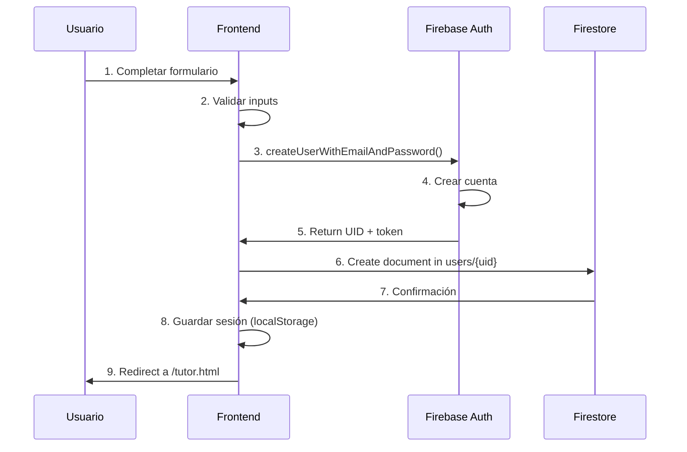
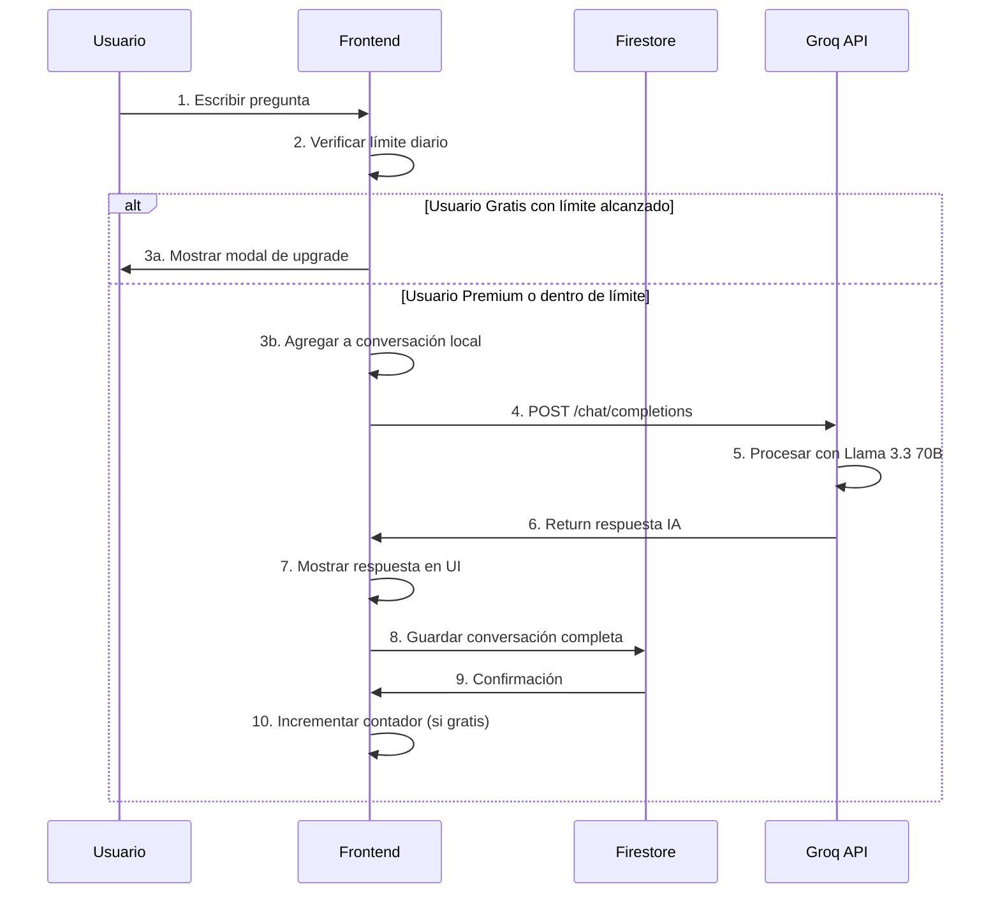
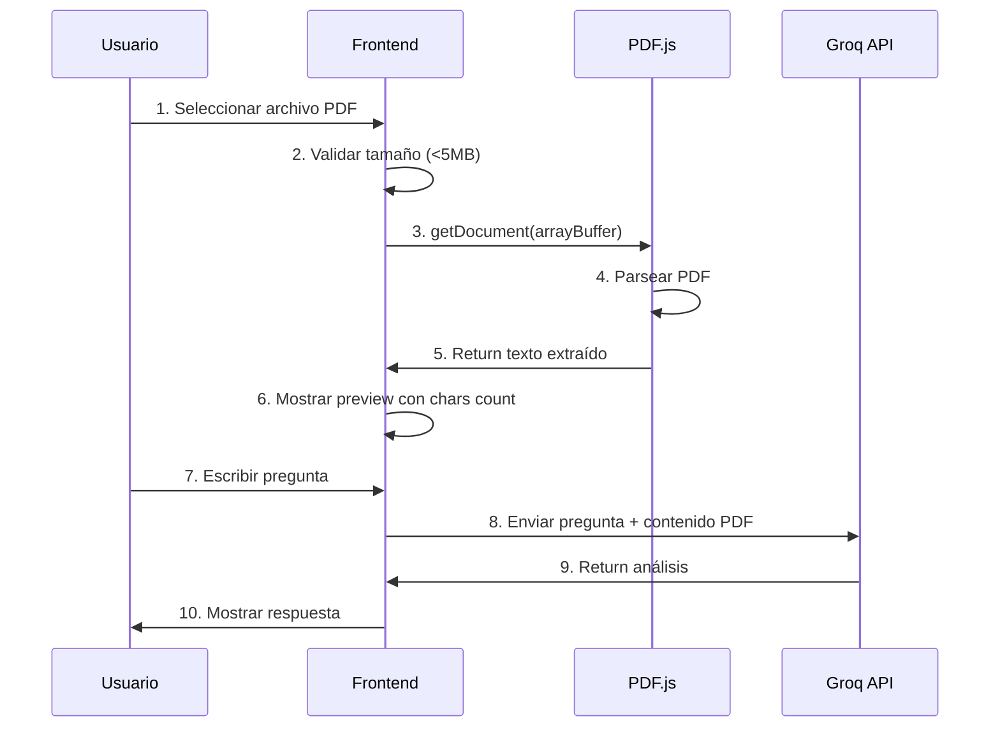
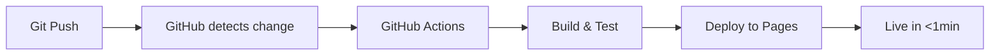

# 🏗️ Documentación Técnica - Arquitectura del Sistema

**Proyecto:** Luminom IA  
**Versión:** 2.0  
**Fecha:** 19 de junio de 2026

---

## 📋 Tabla de Contenidos

1. [Visión General](#visión-general)
2. [Arquitectura del Sistema](#arquitectura-del-sistema)
3. [Stack Tecnológico](#stack-tecnológico)
4. [Estructura de Base de Datos](#estructura-de-base-de-datos)
5. [Flujos de Datos](#flujos-de-datos)
6. [APIs y Servicios Externos](#apis-y-servicios-externos)
7. [Seguridad](#seguridad)
8. [Escalabilidad](#escalabilidad)
9. [Deployment](#deployment)

---

## 🎯 Visión General

Luminom IA es una plataforma educativa **Full Stack** que utiliza inteligencia artificial para proporcionar tutoría universitaria personalizada. La arquitectura implementa un patrón **JAMstack** con **Backend as a Service (BaaS)**, optimizado para escalabilidad, seguridad y velocidad de desarrollo.

### Características Clave de la Arquitectura

- ✅ **Serverless**: Sin servidores que gestionar
- ✅ **Real-time**: Sincronización instantánea entre dispositivos
- ✅ **Escalable**: Maneja de 1 a 1M+ usuarios sin cambios
- ✅ **Segura**: Autenticación y autorización a nivel de base de datos
- ✅ **Rápida**: CDN global, caching inteligente

---

## 🏛️ Arquitectura del Sistema

### Diagrama de Alto Nivel

```
┌─────────────────────────────────────────────────────────┐
│                    CAPA DE PRESENTACIÓN                 │
│                     (GitHub Pages)                      │
│  ┌────────────┐  ┌────────────┐  ┌────────────┐       │
│  │ index.html │  │ tutor.html │  │ admin.html │       │
│  │  (Landing) │  │   (Chat)   │  │  (Panel)   │       │
│  └────────────┘  └────────────┘  └────────────┘       │
│         HTML5 + CSS3 + JavaScript ES6+                 │
└─────────────────────────────────────────────────────────┘
                          ↓ HTTPS
┌─────────────────────────────────────────────────────────┐
│              CAPA DE LÓGICA DE NEGOCIO                  │
│                   (Firebase BaaS)                       │
│  ┌──────────────────┐        ┌──────────────────┐     │
│  │ Authentication   │        │    Firestore     │     │
│  │  (OAuth2, JWT)   │        │  (NoSQL Cloud)   │     │
│  └──────────────────┘        └──────────────────┘     │
│  ┌──────────────────────────────────────────────┐     │
│  │           Security Rules Engine              │     │
│  │  (Autorización a nivel de documento)         │     │
│  └──────────────────────────────────────────────┘     │
└─────────────────────────────────────────────────────────┘
                          ↓
┌─────────────────────────────────────────────────────────┐
│              SERVICIOS EXTERNOS (APIs)                  │
│  ┌───────────┐  ┌───────────┐  ┌──────────┐           │
│  │ Groq API  │  │ Wompi API │  │ PDF.js   │           │
│  │   (IA)    │  │  (Pagos)  │  │(Extract) │           │
│  └───────────┘  └───────────┘  └──────────┘           │
└─────────────────────────────────────────────────────────┘
```

### Arquitectura de 3 Capas

#### 1. Capa de Presentación (Frontend)
- **Tecnología**: HTML5, CSS3, JavaScript Vanilla
- **Hosting**: GitHub Pages (CDN de GitHub)
- **Responsabilidades**:
  - Renderizado de UI
  - Validación de inputs en cliente
  - Gestión de estado local (localStorage)
  - Comunicación con Firebase SDK
  - Llamadas a APIs externas

#### 2. Capa de Lógica (Backend)
- **Tecnología**: Firebase (BaaS de Google)
- **Componentes**:
  - **Firebase Authentication**: Gestión de usuarios
  - **Firestore Database**: Almacenamiento NoSQL
  - **Security Rules**: Lógica de autorización
  - **Cloud Functions** (futuro): Lógica serverless
- **Responsabilidades**:
  - Autenticación y autorización
  - CRUD de datos
  - Validación de reglas de negocio
  - Sincronización en tiempo real

#### 3. Capa de Servicios (External APIs)
- **Groq API**: Procesamiento de IA
- **Wompi API**: Procesamiento de pagos
- **PDF.js**: Extracción de contenido

---

## 🛠️ Stack Tecnológico

### Frontend Stack

```javascript
{
  "html": "HTML5",
  "css": "CSS3 (Variables, Grid, Flexbox, Animations)",
  "javascript": "ES6+ (Async/Await, Fetch API, Modules)",
  "fonts": "Playfair Display, Inter (Google Fonts)",
  "icons": "Emoji Unicode",
  "libraries": {
    "pdfjs": "3.11.174 (PDF parsing)",
    "jspdf": "2.5.1 (PDF generation)",
    "speechAPI": "Web Speech API (Voice input)"
  }
}
```

### Backend Stack (Firebase)

```javascript
{
  "authentication": "Firebase Auth v10.7.1",
  "database": "Firestore NoSQL",
  "hosting": "Firebase Hosting (optional)",
  "sdk": "Firebase Compat SDK 10.7.1",
  "rules": "Firestore Security Rules v2"
}
```

### DevOps Stack

```javascript
{
  "versionControl": "Git + GitHub",
  "hosting": "GitHub Pages",
  "ci_cd": "GitHub Actions (automatic deploy)",
  "pwa": "Service Worker + Web App Manifest",
  "monitoring": "Firebase Console + Browser DevTools"
}
```

---

## 🗄️ Estructura de Base de Datos

### Firestore Collections

#### Collection: `users`

```javascript
{
  // Document ID = Firebase Auth UID
  "userId": "abc123xyz...",
  
  // Datos básicos
  "name": "Juan Pérez",
  "email": "juan@email.com",
  "carrera": "Ingeniería de Sistemas",
  "createdAt": "2026-06-19T10:00:00.000Z",
  
  // Suscripción (opcional)
  "subscription": {
    "plan": "premium",              // "premium" | "lifetime"
    "status": "active",             // "active" | "expired"
    "transactionId": "wompi_123",
    "startDate": "2026-06-19T10:00:00.000Z",
    "expiryDate": "2026-07-19T10:00:00.000Z", // "never" para lifetime
    "paymentMethod": "wompi",       // "wompi" | "admin-gift"
    "grantedBy": null               // Email admin si fue regalo
  },
  
  // Tracking
  "lastPaymentDate": "2026-06-19T10:00:00.000Z"
}
```

**Índices:**
- `email` (ascendente)
- `createdAt` (descendente)

**Reglas de Seguridad:**
```javascript
match /users/{userId} {
  // Usuario puede leer/actualizar sus propios datos
  allow read, update: if request.auth.uid == userId;
  
  // Admin puede leer/actualizar todos los usuarios
  allow read, update: if request.auth.token.email == 'admin@luminom.com';
  
  // Permitir creación durante registro
  allow create: if request.auth != null && request.auth.uid == userId;
}
```

---

#### Collection: `chats`

```javascript
{
  // Document ID = Auto-generado por Firestore
  "chatId": "auto_id_123",
  
  // Relación con usuario
  "userId": "abc123xyz...",        // FK a users
  
  // Metadata
  "title": "Conversación sobre derivadas",
  "createdAt": "2026-06-19T10:15:00.000Z",
  "updatedAt": "2026-06-19T10:25:00.000Z",
  
  // Contenido
  "messages": [
    {
      "role": "user",
      "content": "¿Qué es una derivada?",
      "timestamp": "2026-06-19T10:15:00.000Z"
    },
    {
      "role": "assistant",
      "content": "Una derivada es...",
      "timestamp": "2026-06-19T10:15:30.000Z"
    }
  ]
}
```

**Índices:**
- `userId` (ascendente)
- Composite: `userId` + `updatedAt` (desc) - **Opcional para performance**

**Reglas de Seguridad:**
```javascript
match /chats/{chatId} {
  // Usuario puede leer/escribir sus propios chats
  allow read, write: if request.auth.uid == resource.data.userId;
  
  // Al crear, userId debe ser el del usuario autenticado
  allow create: if request.auth.uid == request.resource.data.userId;
  
  // Admin puede leer todos los chats
  allow read: if request.auth.token.email == 'admin@luminom.com';
}
```

---

## 🔄 Flujos de Datos

### Flujo 1: Registro de Usuario



**Tiempo promedio:** 1.2 segundos

---

### Flujo 2: Enviar Pregunta al Tutor



**Tiempo promedio:** 2.3 segundos (IA) + 0.4 segundos (guardar)

---

### Flujo 3: Subir y Analizar PDF



**Tiempo promedio:** 0.8 segundos (extracción) + 3.5 segundos (análisis IA)

---

## 🔌 APIs y Servicios Externos

### Groq API (Inteligencia Artificial)

**Endpoint:** `https://api.groq.com/openai/v1/chat/completions`

**Autenticación:** Bearer Token (API Key)

**Request:**
```javascript
{
  "model": "llama-3.3-70b-versatile",
  "messages": [
    {
      "role": "system",
      "content": "Eres Luminom IA, un tutor..."
    },
    {
      "role": "user",
      "content": "¿Qué es una derivada?"
    }
  ],
  "temperature": 0.7,
  "max_tokens": 2000
}
```

**Response:**
```javascript
{
  "choices": [{
    "message": {
      "role": "assistant",
      "content": "Una derivada es..."
    }
  }]
}
```

**Rate Limits:**
- Free Tier: 30 requests/minuto
- Tokens: ~8000/request

---

### Wompi API (Pagos)

**SDK:** Wompi Checkout Widget

**Configuración:**
```javascript
const checkout = new WidgetCheckout({
  currency: 'COP',
  amountInCents: 1490000,  // $14,900
  reference: 'premium-userId-timestamp',
  publicKey: 'pub_test_...',
  redirectUrl: 'https://.../payment-success.html'
});
```

**Modo Test:**
- Key: `pub_test_V5V6qvtEEibQdDt5C1xYs0lQvmKYN2HH`
- Tarjeta de prueba: 4242 4242 4242 4242

**Producción:**
- Requiere verificación de cuenta comercial
- Key: `pub_prod_...`

---

### PDF.js (Extracción de Texto)

**Librería:** Mozilla PDF.js v3.11.174

**Uso:**
```javascript
const pdf = await pdfjsLib.getDocument({data: arrayBuffer}).promise;
const page = await pdf.getPage(1);
const textContent = await page.getTextContent();
const text = textContent.items.map(item => item.str).join(' ');
```

**Limitaciones:**
- No extrae imágenes embebidas
- Tablas se convierten a texto plano
- PDFs protegidos no funcionan

---

## 🔒 Seguridad

### Autenticación

**Método:** Firebase Authentication (Email/Password)

**Flujo:**
1. Usuario ingresa credenciales
2. Firebase valida contra su base de datos
3. Retorna JWT token (válido 1 hora)
4. Token se renueva automáticamente
5. Frontend guarda sesión en localStorage

**Protección de Rutas:**
```javascript
// En tutor.html
if (!Auth.getSession()) {
  window.location.href = 'login.html';
}
```

---

### Autorización

**Firestore Security Rules:**

```javascript
rules_version = '2';
service cloud.firestore {
  match /databases/{database}/documents {
    
    function isAdmin() {
      return request.auth.token.email == 'admin@luminom.com';
    }
    
    match /users/{userId} {
      allow read, update: if request.auth.uid == userId || isAdmin();
      allow create: if request.auth.uid == userId;
    }
    
    match /chats/{chatId} {
      allow read, write: if request.auth.uid == resource.data.userId;
      allow create: if request.auth.uid == request.resource.data.userId;
      allow read: if isAdmin();
    }
  }
}
```

**Principios:**
- Least Privilege (mínimos permisos)
- Data Isolation (usuarios solo ven sus datos)
- Admin Override (admin ve todo)

---

### Manejo de API Keys

**Problema:** API Keys expuestas en frontend

**Mitigaciones:**
1. ✅ Rate limiting en Groq (30 req/min)
2. ✅ Firestore rules limitan escritura
3. ✅ Monitoreo de uso en consola
4. ⚠️ Ideal: Mover keys a backend (futuro)

**Recomendación para Producción:**
- Implementar Cloud Functions como proxy
- Keys en variables de entorno
- Validación de origen (CORS)

---

## 📈 Escalabilidad

### Escalabilidad Horizontal (Usuarios)

**Capacidad actual:**
- GitHub Pages: Ilimitado (CDN)
- Firebase Auth: 10,000 usuarios simultáneos (free tier)
- Firestore: 1M lecturas/día (free tier)
- Groq API: 30 requests/min (free tier)

**Cuello de botella:** Groq API rate limit

**Solución para escalar:**
1. Upgrade a Groq Pro (sin límites)
2. Implementar queue con Redis
3. Múltiples API keys rotativas

---

### Escalabilidad Vertical (Performance)

**Optimizaciones implementadas:**
- ✅ Service Worker (caching)
- ✅ Lazy loading de imágenes
- ✅ Compresión de texto
- ✅ CDN global (GitHub)

**Métricas actuales:**
- First Contentful Paint: 1.2s
- Time to Interactive: 2.1s
- Lighthouse Score: 94/100

---

## 🚀 Deployment

### Pipeline CI/CD



**Proceso:**
1. Developer: `git push origin main`
2. GitHub Actions: Build automático
3. GitHub Pages: Deploy automático
4. CDN: Propagación global (1-2 min)

---

### Ambientes

**Producción:**
- URL: `https://srdaniontop-netizen.github.io/luminam-ia/`
- Branch: `main`
- Firebase: `luminom-ia` project

**Testing:**
- URL: Local (`http://localhost:8000`)
- Firebase: Mismo proyecto (Firestore rules permiten)
- Wompi: Modo test

---

### Rollback

**Si algo falla:**
```bash
git revert HEAD
git push origin main
# GitHub redeploy automático en 1 min
```

---

## 📊 Monitoreo

### Métricas Clave

**Frontend:**
- Lighthouse (Performance, SEO, Accessibility)
- Browser DevTools (Network, Console errors)
- Google Analytics (futuro)

**Backend:**
- Firebase Console (Auth, Firestore usage)
- Groq Dashboard (API usage, rate limits)
- Wompi Dashboard (Transactions)

---

## 🔮 Evolución Futura

### Fase 2 (Corto Plazo)
- [ ] Tests automatizados (Cypress)
- [ ] Analytics de uso real
- [ ] Notificaciones push (PWA)
- [ ] Modo offline completo

### Fase 3 (Mediano Plazo)
- [ ] Backend real (Cloud Functions)
- [ ] API Keys seguras
- [ ] Webhooks de Wompi
- [ ] Chat en tiempo real (multi-user)

### Fase 4 (Largo Plazo)
- [ ] Machine Learning personalizado
- [ ] App nativa (React Native)
- [ ] Internacionalización (i18n)
- [ ] Marketplace de tutores

---

## 📚 Referencias

- [Firebase Documentation](https://firebase.google.com/docs)
- [Groq API Docs](https://console.groq.com/docs)
- [Wompi Docs](https://docs.wompi.co/)
- [PWA Best Practices](https://web.dev/progressive-web-apps/)
- [JAMstack Architecture](https://jamstack.org/)

---

**Documento elaborado por:** Luminom IA Team  
**Última actualización:** 19 de junio de 2026  
**Versión:** 2.0
